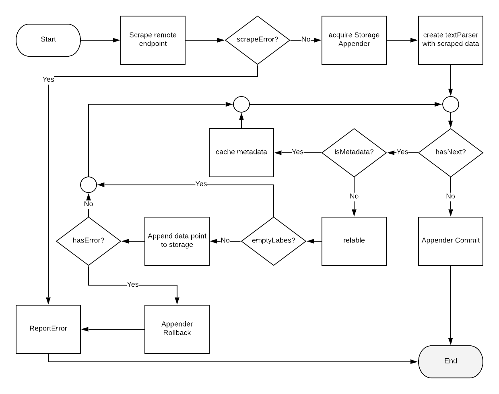

# Prometheus Receiver Design Spec

## Design Goal

### Provide a seamless onboarding experience for users who are already familiar with prometheus scrape config

Prometheus has a very powerful config system for user to config how prometheus can scrape the metrics data from any 
application which expose a prometheus format metrics endpoint. It provides very useful features like filtering unwanted 
metrics, relabeling tags..etc. The original prometheus receiver of Opencensus took the approach of using prometheus' own 
scraper's source code as a library to achieve this goal. Overall the idea was great, however, the original 
implementation has a lot of glitches, it cannot be fixed by small patches. This new prometheus receiver is going to 
follow the same idea of leveraging prometheus souce code, with a proper implement. 

### Map prometheus metrics to the corresponding opencensus metrics properly

Prometheus receiver shall be able to map prometheus metrics to ocagent's proto based metrics, it shall respect the 
original metric name, value, timestamp, as well as tags. It doesn't need to provide one-to-one mapping, since supported 
metric types are different from the two systems.  However, it shall not drop data.

### Parity between prometheus and ocagent prometheus exporter

Prometheus itself can also used as an exporter, that it can expose the metrics it scrape from other system with its own 
metrics endpoint, so is ocagent. We shall be able to retain parity from the following two setups: 

1. app -> promethues -> metric-endpoint 
2. app -> ocgent-with-prometheus-receiver -> ocagent-promethues-exporter-metrics-endpoint


## Prometheus Text Format Overview

Prometheus text format is a line orient format.  For each non-empty line, which not begins with #, is a metric data 
point with includes a metric name and its value, which is of float64 type, as well as some optional data such as tags 
and timestamp, which is in milliseconds. For lines begin with #, they are either comments, which need to be filtered, 
or metadata, which including type hints and units that are usually indicating the beginning of a new individual metric 
or a group of new metrics. More details of prometheus text format can be found from its 
[official document](https://prometheus.io/docs/instrumenting/exposition_formats/#text-based-format). 

### Metric types
Based on this document, prometheus supports the following 5 types of metrics: 
* Counter 
* Gauge 
* Histogram 
* Summary 
* Untyped   

However, this is not the whole story, from the implementation details of prometheus scraper, which the receiver based on,
it supports a couple more undocumented metrics types, including: 

* Gaugehistogram 
* Info
* Statset

More details can be found from the
[prometheus text parser source code]( https://github.com/prometheus/prometheus/blob/master/pkg/textparse/interface.go#L82)


### Metric Grouping

Other than metric types, the type hint comment and metric grouping are also important to know in order to parse prometheus
text metrics properly. From any prometheus metrics endpoints, metrics are usually grouped together by starting with a 
comment section which includes some very important information like type hints about the metrics, and metrics points of the same
group will have the same metric name but a different set of tag values, for example:

```
# HELP container_cpu_load_average_10s Value of container cpu load average over the last 10 seconds.
# TYPE container_cpu_load_average_10s gauge
container_cpu_load_average_10s{id="/",image="",name=""} 0
container_cpu_load_average_10s{id="/000-metadata",image="",name=""} 0
container_cpu_load_average_10s{id="/001-sysfs",image="",name=""} 0
```

The above example was taken from an cadvisor metric endpoint, the type hint tells that the name of this metric group is
`container_cpu_load_average_10s` and it's of `gague` type. Then it follows by some individual metric points which are of the 
same metric name. For each individual metric within this group, they share the same set of tag keys, with unique value sets.


## Prometheus Metric Scraper Anatomy 

The metrics scraper is a component which is used to scrape remote prometheus metric endpoints, it is also the component 
which ocagent prometheus receiver is based on. It's important to understand how it works in order to implement the receiver
properly. 

### Major components of Prometheus Scape package

- **[ScapeManager](https://github.com/prometheus/prometheus/blob/v2.9.2/scrape/manager.go):** 
the component which loads the scrape_config, and manage the scraping tasks

- **[ScrapePool](https://github.com/prometheus/prometheus/blob/d3245f15022551c6fc8281766ea62db4d71e2747/scrape/scrape.go#L154-L439):** 
an object which manage scrapes for a sets of targets

- **[Scraper](https://github.com/prometheus/prometheus/blob/d3245f15022551c6fc8281766ea62db4d71e2747/scrape/scrape.go#L506-L511):** 
a http client to fetch data from remote metrics endpoints

- **[Target](https://github.com/prometheus/prometheus/blob/v2.9.2/scrape/target.go):** 
the remote metric endpoint, as well as related relabing settings and other metadata

- **[TextParser](https://github.com/prometheus/prometheus/tree/v2.9.2/pkg/textparse):** 
a DFA style streaming decoder/parser for prometheus text format

- **[Appendable](https://github.com/prometheus/prometheus/blob/d3245f15022551c6fc8281766ea62db4d71e2747/scrape/manager.go#L37-L39):** 
it is used to acquire a storage appender instance at the beginning of each scrapeLoop run

- **[storage.Appender](https://github.com/prometheus/prometheus/blob/d3245f15022551c6fc8281766ea62db4d71e2747/storage/interface.go#L86-L95):** 
an abstraction of the metric storage which can be a filesystem, a database or an remote endpoint...etc. As for opencensus prometheus receiver, this is 
also the interface we need to implement to provide a customized storage appender which is backed by an ocagent metrics sink.  

- **[ScrapeLoop](https://github.com/prometheus/prometheus/blob/d3245f15022551c6fc8281766ea62db4d71e2747/scrape/scrape.go#L586-L1024):** 
the actual scrape pipeline which performs the main scraping and ingestion logic.


### Prometheus ScrapeLoop workflow explained
Each scraping cycle is trigger by an configured interval, its workflow is as shown in the flowchart below:



It basically does the following things in turn:

  1. make a http call to fetch data from the binding [target](#target)'s metrics endpoint with [scraper](#scraper)
  2. acquired a [storage appender](#storage-appender) instance with the [Appendable](#appendable) interface 
  3. feed the data to a textParser
  4. parse and feed metric data points to storage appender
  5. commit if success or rollback
  6. report task status
  
  
## Implement prometheus storage.Appender with ocagent metrics sink

### The storage.Appender interface
As discussed in the previous section, the storage.Appender is the most important piece of components for us to implement so as to bring the two worlds together. 
It has a very simple interface which is defined below:
```go
type Appender interface {
  Add(l labels.Labels, t int64, v float64) (uint64, error)


  AddFast(l labels.Labels, ref uint64, t int64, v float64) error


  // Commit submits the collected samples and purges the batch.
  Commit() error


  Rollback() error
}
```

*Note: the above code belongs to the prometheus project, its license can be found [here](https://github.com/prometheus/prometheus/blob/v2.9.2/LICENSE)*


One can see that the interface is very simple, it only has 4 methods: `Add`, `AddFast`, `Commit` and `Rollback`. 
The last two methods are easy to understand: `Commit` is called when the processing of the scraped page is completed and 
success, whereas `Rollback` is called if error occurs in between the process.

However for the two methods starting with 'Add', there's no document on the prometheus project for how they should be used. 
By examining the scrapeLoop source code, as well as some storage.Appender implementations. It indicates that the first 
method `Add` is always used for the first time when a unique metrics, which means the combination of metric name and its 
tags are unique, is seen for the first time. The `Add` method can return a non zero reference number, then the scrapeLoop 
can cache this number with the metric's uniq signature. The next time, such as the next scrape cycle of the same target, 
when the metric is seen again by matching its signature, it will call the `AddFast` method with the cached reference number. 
This reference number might make sense to databases which has unique key as numbers, however, in our use case, it's not 
necessary, thus we can always return 0 ref number from the `Add` method to skip this caching mechanism.


### Challenges and solutions
Even though the definition of this interface is very simple, however, to implement it properly is a bit challenging, given that
every time the Add/AddFast method is called, it only provides the information about the current data point, the context of what metric group
this data point belonging to is not provided, we have to keep track of it internally within the appender.  And this is not the whole story,
there are a couple other issues we need to address, including:

1. Have a way to link the Target with the current appender instance

The labels provided to the Add/AddFast methods dose not include some target specified information such as `job name` 
which is important construct the 
[Node proto](https://github.com/census-instrumentation/opencensus-proto/blob/e2601ef16f8a085a69d94ace5133f97438f8945f/src/opencensus/proto/agent/common/v1/common.proto#L36-L51) 
object of Opencensus. The target object is not accessible from the Appender interface, however, we can get it from the ScrapeManager, when designing the
ocagent appender, we need to have a way to inject the binding target into the appender instance.


3. Group metrics from the same family together
                                                                                                                                                                                                                                                                                                                                                                           
In Opencensus, metric points of the same name are usually grouped together as one timeseries but different data points. 
It's important for the appender to keep track of the metric family changes, and group metrics of the same family together.
Keep in mind that the Add/AddFast method is operated in a streaming manner, ScrapeLoop does not provide any direct hints on metric name change, 
the appender itself need to keep track of it. It's also important to know that for some special types such as `histogram` 
and `summary`, not all the data points have the same name, there are some special metric points has postfix like `_sum` and `_count`, 
we need to handle this properly, and do not consider this is a metric family change.


4. Group complex metrics such as histogram together in proper order

In Prometheus, a single aggregated type of metric data such as `histogram` and `summary` is represent by multiple metric data points, such as
buckets and quantiles as well as the additional `_sum` and `_count` data. ScrapeLoop will feed them into the appender individually. The ocagent
appender need to have a way to bundle them together to transform them into a single Metric Datapoint Proto object. 

5. Tags need to handle carefully

ScrapeLoop strips out any tag with empty value, however, in Opencenus, the tag keys is stored separately, we need to able to get all the possible tag keys
of the same metric family before committing the metric family to the sink.


## Prometheus Metric to Opencensus Metric Proto Mapping


### Target as Node
The Target of prometheus is defined by the scrape_config, it has the information like `hostname` of the remote service,
and a user defined `job name` which can be used as the service name. These two piece of information makes it a great fit
to map it into the `Node` proto of the Opencensus MetricsData type, as shown below: 

```go
type MetricsData struct {
  Node     *commonpb.Node
  Resource *resourcepb.Resource
  Metrics  []*metricspb.Metric
}
```

The scrape page as whole also can be fit into the above `MetricsData` data structure, and all the metrics data points 
can be stored with the `Metrics` array. We will explain the mappings of individual metirc types in the following couple sections


### Metric Value Mapping
 In OpenCensus, metrics value types can be either `int64` or `float64`, while in in Prometheus the value can be safety assume it's always `float64` based on the 
[Prometheus Text Format Document](https://prometheus.io/docs/instrumenting/exposition_formats/#text-format-details) as quoted below:

> value is a float represented as required by Go's ParseFloat() function. In addition to standard numerical values, Nan, +Inf, and -Inf are valid values representing not a number, positive infinity, and negative infinity, respectively.

It will make sense for us to stick with this data type as much as possible across all metrics types


### Counter
Counter is one of the simplest data types we have in both Prometheus and Ocagent, it's mapping is as shown below

For the following Prometheus Counters:
```
# HELP http_requests_total The total number of HTTP requests.
# TYPE http_requests_total counter
http_requests_total{method="post",code="200"} 1027
http_requests_total{method="post",code="400"}    3
```

The corresponding Ocagent Metric will be:
```go
metrics := []*metricspb.Metric{
  {
    MetricDescriptor: &metricspb.MetricDescriptor{
      Name:      "http_requests_total",
      Type:      metricspb.MetricDescriptor_CUMULATIVE_DOUBLE,
      LabelKeys: []*metricspb.LabelKey{{Key: "method"}, {Key: "code"}}},
    Timeseries: []*metricspb.TimeSeries{
      {
        StartTimestamp: tsOc,
        LabelValues:    []*metricspb.LabelValue{{Value: "post", HasValue: true}, {Value: "200", HasValue: true}},
        Points: []*metricspb.Point{
          {Timestamp: tsOc, Value: &metricspb.Point_DoubleValue{DoubleValue: 1027.0}},
        },
      },
      {
        StartTimestamp: tsOc,
        LabelValues:    []*metricspb.LabelValue{{Value: "post", HasValue: false}, {Value: "400", HasValue: true}},
        Points: []*metricspb.Point{
          {Timestamp: tsOc, Value: &metricspb.Point_DoubleValue{DoubleValue: 3.0}},
        },
      },
    },
  },
}
```

*Note: `tsOc` is a timestamp object representing the current ts*


### Gauge
For the following Prometheus Gauges:
```
# HELP gauge_test some test gauges.
# TYPE gauge_test gague
gauge_test{id="1",foo="bar"} 1.0
gauge_test{id="2",foo=""}    2.0

```

The corresponding Ocagent Metric will be: 
```go
metrics := []*metricspb.Metric{
  {
    MetricDescriptor: &metricspb.MetricDescriptor{
      Name:      "gauge_test",
      Type:      metricspb.MetricDescriptor_GAUGE_DOUBLE,
      LabelKeys: []*metricspb.LabelKey{{Key: "id"}, {Key: "foo"}}},
    Timeseries: []*metricspb.TimeSeries{
      {
        StartTimestamp: tsOc,
        LabelValues:    []*metricspb.LabelValue{{Value: "1", HasValue: true}, {Value: "bar", HasValue: true}},
        Points: []*metricspb.Point{
          {Timestamp: tsOc, Value: &metricspb.Point_DoubleValue{DoubleValue: 1.0}},
        },
      },
      {
        StartTimestamp: tsOc,
        LabelValues:    []*metricspb.LabelValue{{Value: "2", HasValue: true}, {Value: "", HasValue: false}},
        Points: []*metricspb.Point{
          {Timestamp: tsOc, Value: &metricspb.Point_DoubleValue{DoubleValue: 2.0}},
        },
      },
    },
  },
}
```


### Histogram
Histogram is a complex data type, in Prometheus, it uses multiple data points to represent a single histogram, example
as shown below:
```
# HELP hist_test This is my histogram vec
# TYPE hist_test histogram
hist_test_bucket{t1="1",,le="10.0"} 1.0
hist_test_bucket{t1="1",le="20.0"} 3.0
hist_test_bucket{t1="1",le="+inf"} 10.0
hist_test_sum{t1="1"} 100.0
hist_test_count{t1="1"} 10.0
hist_test_bucket{t1="2",,le="10.0"} 10.0
hist_test_bucket{t1="2",le="20.0"} 30.0
hist_test_bucket{t1="2",le="+inf"} 100.0
hist_test_sum{t1="2"} 10000.0
hist_test_count{t1="2"} 100.0

```

Its corresponding Ocagent metrics is as shown below:
```go
metrics := []*metricspb.Metric{
  {
    MetricDescriptor: &metricspb.MetricDescriptor{
      Name:      "hist_test",
      Type:      metricspb.MetricDescriptor_CUMULATIVE_DISTRIBUTION,
      LabelKeys: []*metricspb.LabelKey{{Key: "t1"}}},
    Timeseries: []*metricspb.TimeSeries{
      {
        StartTimestamp: tsOc,
        LabelValues:    []*metricspb.LabelValue{{Value: "1", HasValue: true}},
        Points: []*metricspb.Point{
          {Timestamp: tsOc, Value: &metricspb.Point_DistributionValue{
            DistributionValue: &metricspb.DistributionValue{
              BucketOptions: &metricspb.DistributionValue_BucketOptions{
                Type: &metricspb.DistributionValue_BucketOptions_Explicit_{
                  Explicit: &metricspb.DistributionValue_BucketOptions_Explicit{
                    Bounds: []float64{10, 20},
                  },
                },
              },
              Count:   10,
              Sum:     100.0,
              Buckets: []*metricspb.DistributionValue_Bucket{{Count: 1}, {Count: 2}, {Count: 7}},
            }}},
        },
      },
      {
        StartTimestamp: tsOc,
        LabelValues:    []*metricspb.LabelValue{{Value: "2", HasValue: true}},
        Points: []*metricspb.Point{
          {Timestamp: tsOc, Value: &metricspb.Point_DistributionValue{
            DistributionValue: &metricspb.DistributionValue{
              BucketOptions: &metricspb.DistributionValue_BucketOptions{
                Type: &metricspb.DistributionValue_BucketOptions_Explicit_{
                  Explicit: &metricspb.DistributionValue_BucketOptions_Explicit{
                    Bounds: []float64{10, 20},
                  },
                },
              },
              Count:   100,
              Sum:     10000.0,
              Buckets: []*metricspb.DistributionValue_Bucket{{Count: 10}, {Count: 20}, {Count: 70}},
            }}},
        },
      },
    },
  },
}

```

There's an important difference between Prometheus bucket and OpenCensus bucket that, bucket counts from Prometheus are 
cumulative, to transform this into OpenCensus format, one need to apply the following formula: 
```CurrentOCBucketVlaue = NextPrometheusBucketValue - CurrentPrometheusBucketValue```

OpenCensus does not use `+inf` as bound, one need to remove it to generate the Bounds of the OpenCensus Bounds.

There's also one thing that is required by OpenCensus format for histogram the `SumOfSquaredDeviation`, however, it is 
not provided from Prometheus, we have to set this value to `0`

### Gaugehistogram

This is an undocumented data type, it shall be same as regular [Histogram](#histogram)

### Summary

Same as histogram, summary is also a complex metric type which is represent by multiple data points:
```
# HELP go_gc_duration_seconds A summary of the GC invocation durations.
# TYPE go_gc_duration_seconds summary
go_gc_duration_seconds{quantile="0"} 0.0001271
go_gc_duration_seconds{quantile="0.25"} 0.0002455
go_gc_duration_seconds{quantile="0.5"} 0.0002904
go_gc_duration_seconds{quantile="0.75"} 0.0003426
go_gc_duration_seconds{quantile="1"} 0.0023638
go_gc_duration_seconds_sum 17.391350544
go_gc_duration_seconds_count 52489
```

The corresponding Ocagent metrics is as shown below:

```go
metrics := []*metricspb.Metric{
  {
    MetricDescriptor: &metricspb.MetricDescriptor{
      Name:      "go_gc_duration_seconds",
      Type:      metricspb.MetricDescriptor_SUMMARY,
      LabelKeys: []*metricspb.LabelKey{}},
    Timeseries: []*metricspb.TimeSeries{
      {
        StartTimestamp: tsOc,
        LabelValues:    []*metricspb.LabelValue{},
        Points: []*metricspb.Point{
          {Timestamp: tsOc, Value: &metricspb.Point_SummaryValue{
            SummaryValue: &metricspb.SummaryValue{
              Snapshot: &metricspb.SummaryValue_Snapshot{
                PercentileValues: []*metricspb.SummaryValue_Snapshot_ValueAtPercentile{
                  {Percentile: 0.0,   Value: 0.0001271},
                  {Percentile: 25.0,  Value: 0.0002455},
                  {Percentile: 50.0,  Value: 0.0002904},
                  {Percentile: 75.0,  Value: 0.0003426},
                  {Percentile: 100.0, Value: 0.0023638},
                },
                Sum:   &wrappers.DoubleValue{Value: 17.391350544},
                Count: &wrappers.Int64Value{Value: 52489},
              }}}},
        },
      },
    },
  },
}

```

The major difference between the two formats is that in Prometheus it uses quantile, while in OpenCenus Percentile is used.

There's one thing that is required by Summary proto that is missing from Prometheus 

### Others

For any other prometheus metrics type, they will make to the [Guage](#gague) type of Ocagent